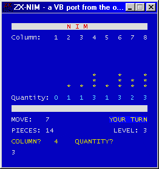



## ZX\-NIM \- A VB port from the original ZX Spectrum Game

### Description

NIM was one of the games once existed for the great ZX-Spectrum... now i decided to port it to VB... i know it looks pretty bad, but once you take a look to the readme you will now why i did it.
 
### More Info
 

             |
---                |---
**Submitted On**   |2002-06-24 14:53:30
**By**             |[gonchuki\_](https://github.com/Planet-Source-Code/PSCIndex/blob/master/ByAuthor/gonchuki.md)
**Level**          |Intermediate
**User Rating**    |5.0 (10 globes from 2 users)
**Compatibility**  |VB 5\.0, VB 6\.0
**Category**       |[Games](https://github.com/Planet-Source-Code/PSCIndex/blob/master/ByCategory/games__1-38.md)
**World**          |[Visual Basic](https://github.com/Planet-Source-Code/PSCIndex/blob/master/ByWorld/visual-basic.md)
**Archive File**   |[ZX\-NIM\_\-\_A998666282002\.zip](https://github.com/Planet-Source-Code/gonchuki-zx-nim-a-vb-port-from-the-original-zx-spectrum-game__1-36359/archive/master.zip)

